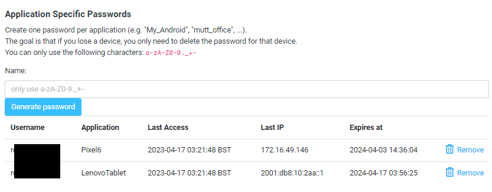

# Show Last Access / IP 

With dovecot's [last_login plugin](https://doc.dovecot.org/configuration_manual/lastlogin_plugin/) 
enabled, we can get information on the last access time and IP address and display this for each
application specific password.

**This feature is a work in progress and may change / disappear.**

## Dovecot configuration

`/etc/dovecot/conf.d/10-last-login.conf:`

```
plugin {
  last_login_dict = proxy::sql
  last_login_key = last-login/%{service}/%{user}/%{remote_ip}/%{userdb:ap_id:0}
  last_login_precision = s
}

dict {
  sql = mysql:/etc/dovecot/dovecot-dict-sql.conf.ext
}
```

`/etc/dovecot/dovecot-dict-sql.conf.ext:`

```
connect = host=<host> dbname=<database_name> user=<database_user> password=<database_password>

map {
  pattern = shared/last-login/$service/$user/$remote_ip/$ap_id
  table = last_login
  value_field = last_access
  value_type = uint

  fields {
    userid = $user
    service = $service
    last_ip = $remote_ip
    ap_id = $ap_id
  }
}
```

DB Schema (MySQL):

```
CREATE TABLE `last_login` (
	`userid` VARCHAR(255) NOT NULL COLLATE 'utf8mb4_unicode_ci',
	`service` VARCHAR(10) NOT NULL COLLATE 'utf8mb4_unicode_ci',
	`last_access` BIGINT(19) NOT NULL,
	`last_ip` VARCHAR(40) NOT NULL COLLATE 'utf8mb4_unicode_ci',
	`ap_id` INT(10) NOT NULL,
	PRIMARY KEY (`userid`, `service`, `ap_id`, `last_ip`) USING BTREE
)
COLLATE='utf8mb4_unicode_ci'
ENGINE=InnoDB
;
```

I could not get the last_login plugin / dovecot's dict to update the `last_ip`
column (as suggested in their example). It only seems to set `last_ip` when 
the row is first created. On subsequent access, it only updates the `last_access`
column.

The 'hack' for this (at the moment) is to set userid, service, ap_id, and last_ip
as the primary key. This means `last_ip` will be updated, but there will be
multiple rows per user (not ideal, but the only way I could make it work!).

Dovecot dict does something like:

```
INSERT INTO last_login (last_access,service,userid,last_ip,ap_id) VALUES (1681695393,'imap','user@example.com','192.168.0.10','20') ON DUPLICATE KEY UPDATE last_access=1681695393
```

So only last_access is updated on subsequent logins.

Next, the passdb lookup for application passwords needs to return the id of the application password.
(In this case returning `ap_id` to `userdb_ap_id`)

```
# Database driver: mysql, pgsql, sqlite
driver = mysql
connect = host=<host> dbname=<database_name> user=<database_user> password=<database_password>
default_pass_scheme = SHA512

# Use the same username everywhere,
# select by password:
password_query = \
   SELECT username, password, id as userdb_ap_id \
   FROM application_passwords \
   WHERE username='%u' \
         AND password = SHA2('%w',"512") \
         AND created >= NOW() - INTERVAL 2 MONTH;
```

Here is a slightly fancier example where dovecot uses the table p_mailbox for regular 
users, and for application passwords, we join this table to get extra properties.
(p_mailbox is adopted from postfixadmin's schema.) If a user is deactivated or 
removed from p_mailbox, then all the application passwords will also stop working.

```
password_query = \
   SELECT ap.username AS username, \
    ap.password AS password, \
    ap.id AS userdb_ap_id \
   FROM \
    roundcubemail.application_passwords ap INNER JOIN \
    roundcubemail.p_mailbox mb ON mb.username = ap.username \
   WHERE ap.username='%u' \
         AND mb.active = 1 \
         AND ap.password = '%{sha512:password}' \
         AND ap.created >= NOW() - INTERVAL 2 MONTH;
```

After changing the configuration, run `doveadm reload`

You should start to see dovecot adding entries to the table:

```
mysql> select * from last_login;
+--------------------+---------+-------------+---------------------+-------+
| userid             | service | last_access | last_ip             | ap_id |
+--------------------+---------+-------------+---------------------+-------+
| fred@example.com   | imap    |  1681699293 | 2001:db8:10:1aa::1  |     0 |
| fred@example.com   | imap    |  1681698108 | 172.16.49.146       |    20 |
| boris@example.com  | imap    |  1681697493 | 31.94.5.149         |     0 |
| boris@example.com  | imap    |  1681698393 | 31.94.5.149         |    19 |
+--------------------+---------+-------------+---------------------+-------+
```

## Roundcube ap4rc configuration

`config.inc.php`

```php
// Enable show last access/IP columns
// (see README_LAST_ACCESS.md to get this working)
$config['ap4rc_show_last_access'] = true;

// Table to get ap_id from (if not last_login):
// $config['ap4rc_last_access_table'] = 'last_login';
```




## Data cleanup

Periodically clean up "duplicate" old rows.

Note that this will delete all the rows with `ap_id` = `0` 
(login not with application password).

```sql
-- Delete all last_login rows where application_password id no longer exists:
DELETE FROM last_login WHERE ap_id NOT IN ( select id from application_passwords );

-- Keep only most recent (highest) last login entry for each ap_id:
DELETE t1 FROM last_login t1
INNER JOIN last_login t2 
WHERE 
    t1.last_access < t2.last_access AND 
    t1.ap_id = t2.ap_id;
```

## TODO

- Configurable date format.
- Purge old IPs from last_login.


## Postfixadmin mailbox table:

In case you are interested.

I don't currently use postfixadmin, but decided to use the same table schema, as there
are a few nice examples and tutorials for getting dovecot working with postfixadmin's 
schema (not just MySQL). Postfixadmin is essentially just a database and can work 
with any MTA, although is geared towards the postfix way of doing things. 
Some of it may not be relevant if you are using dovecot+sieve for vacation 
/ auto reply, for example.

Instead of a separate database, I put this into roundcube's database, prefixed
with `p_`.

```sql
CREATE TABLE `p_mailbox` (
	`username` VARCHAR(255) NOT NULL COLLATE 'latin1_general_ci',
	`password` VARCHAR(255) NOT NULL COLLATE 'latin1_general_ci',
	`name` VARCHAR(255) NOT NULL COLLATE 'utf8mb4_0900_ai_ci',
	`maildir` VARCHAR(255) NOT NULL COLLATE 'latin1_general_ci',
	`quota` BIGINT(19) NOT NULL DEFAULT '0',
	`local_part` VARCHAR(255) NOT NULL COLLATE 'latin1_general_ci',
	`domain` VARCHAR(255) NOT NULL COLLATE 'latin1_general_ci',
	`created` DATETIME NOT NULL DEFAULT '2000-01-01 00:00:00',
	`modified` DATETIME NOT NULL DEFAULT '2000-01-01 00:00:00',
	`active` TINYINT(1) NOT NULL DEFAULT '1',
	`phone` VARCHAR(30) NOT NULL DEFAULT '' COLLATE 'utf8mb4_0900_ai_ci',
	`email_other` VARCHAR(255) NOT NULL DEFAULT '' COLLATE 'utf8mb4_0900_ai_ci',
	`token` VARCHAR(255) NOT NULL DEFAULT '' COLLATE 'utf8mb4_0900_ai_ci',
	`token_validity` DATETIME NOT NULL DEFAULT '2000-01-01 00:00:00',
	`password_expiry` DATETIME NOT NULL DEFAULT '2000-01-01 00:00:00',
	PRIMARY KEY (`username`) USING BTREE,
	INDEX `domain` (`domain`) USING BTREE
)
COMMENT='Postfix Admin - Virtual Mailboxes'
COLLATE='latin1_general_ci'
ENGINE=InnoDB
;
```
Example dovecot query to lookup from the above.
(Pretty much same as postfixadm example)

`/etc/dovecot/dovecot-sql-users.conf.ext:` 

```
driver = mysql
connect = host=<host> dbname=<database_name> user=<database_user> password=<database_password>
default_pass_scheme = BLF-CRYPT

password_query = \
       SELECT username, \
              password \
        FROM p_mailbox \
        WHERE username = '%u' AND active='1';

user_query = \
       SELECT username, \
              CONCAT('/var/mailboxes/', maildir) AS home, \
              CONCAT('*:bytes=', quota) AS quota_rule \
        FROM p_mailbox \
        WHERE username = '%u' AND active='1';

# Query to get a list of all usernames.
iterate_query = SELECT username FROM p_mailbox WHERE active = '1';
```
